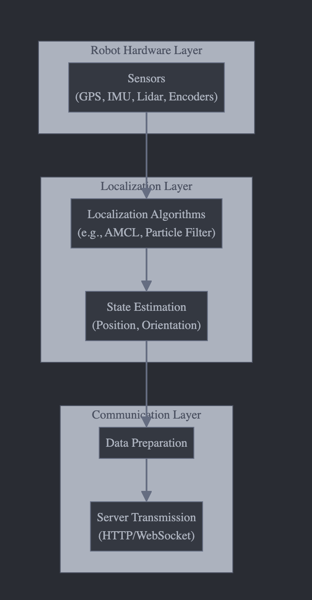

# gogo-car

**基本の機能の実装**
1. サーバーの起動
サーバーを起動し、ポートの指定や初期設定
2. ルーティングの設定
基本的なエンドポイントの設定。リエすとを適切なハンドラーへ渡す
3. ヘルスチェックエンドポイントの作成
サーバーの状態を確認できる潰れることのない安全なエンドポイントを作成
4。middleware

こんな感じで進めていく。

自分はロボットを動かす操作はできないのですることは
- サーバーで取得したデータを受信
  - [ ] websocketで
- そのサーバー内で位置推定アルゴリズムを走らせる。大学で学んだものの中で良さそうなやつ
- 位置情報の確率マップをロボットに送信
- そこから動いてもらう
- (本当は次どこに動くかとかも決めたいけど、これは今後実装。とりあえずは自己位置の推定から)

## 課題
- どうやってマップを与えるのか
  - iphoneのLiDARで簡単な3Dデータは作成できるので、それをどうにか解釈できる形に直す
- テストをするための環境
  - シミュレーションを簡単にできるような物理エンジンも導入したい
- 動機をどう与えるか
  - とりあえずはマップの中をぐるぐると探索するようなものにする
  - 個人的にはUberのタクシーのイメージで、他にもロボットを作ってそれが指定されたポイント間を効率よく周回するようにしたい
